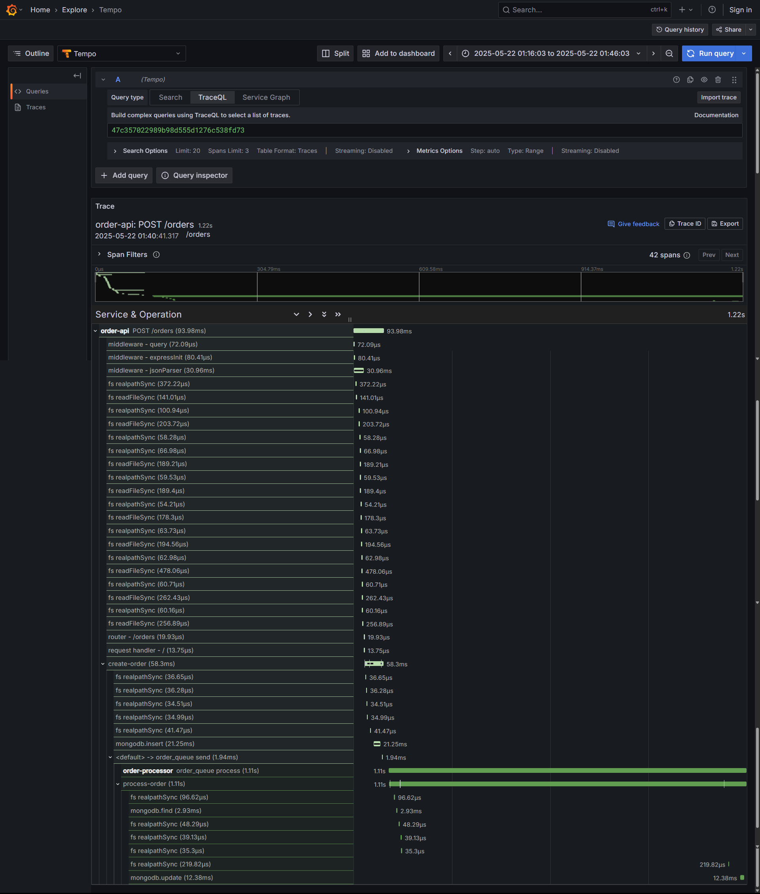

# order-processing-system


This is a simple order processing system that allows you to create orders and get order details. It has two main components:

1. Order API: A REST API that allows you to create orders and get order details.
2. Order Processor: A background service that processes orders and updates the order status.

For decoupling the two components, used RabbitMQ to send messages between the two components.

System Architecture:

%20copy.svg)

## Setup

Start Docker Compose:

```bash
docker-compose up -d
```

Check the status of the containers:

```bash
docker-compose ps
```

## Test the System

POST request to create an order:

```bash
curl -X POST http://localhost:8081/orders \
  -H "Content-Type: application/json" \
  -d '{
    "customerId": "cust123",
    "customerEmail": "user@example.com",
    "items": [
      {
        "productId": "prod1",
        "name": "Laptop",
        "quantity": 1,
        "price": 1000
      }
    ],
    "shippingAddress": {
      "street": "123 Main St",
      "city": "New York",
      "state": "NY",
      "zipCode": "10001",
      "country": "USA"
    }
  }' | jq
```

Get order details:


```bash
curl http://localhost:8081/orders/<order_id> | jq
```

Trace Output:




